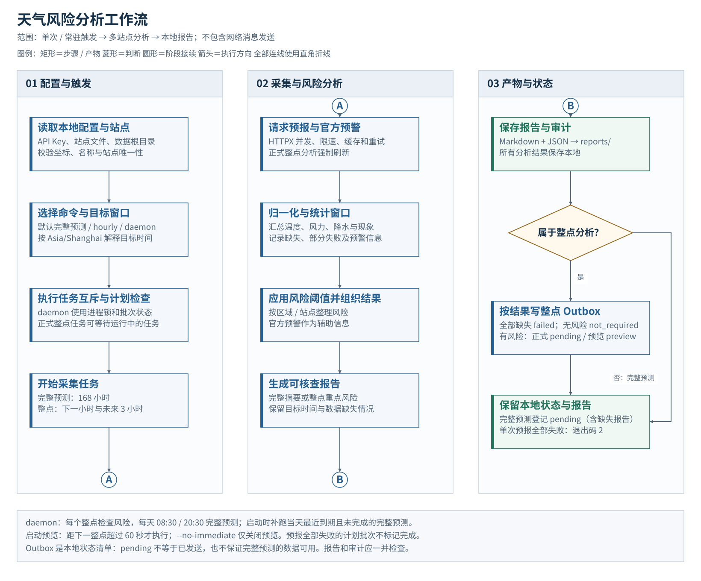
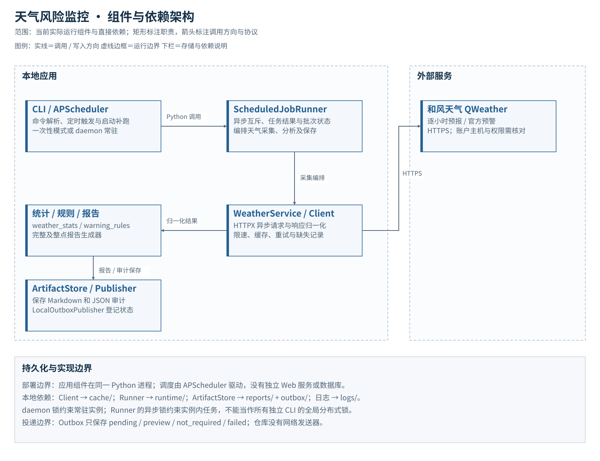

<div align="center">

# Weather Risk Monitor

**天气风险监控 · 从站点预报到可核查的风险报告**

[Python 3.10+](pyproject.toml) · HTTPX · APScheduler · QWeather

[功能](#功能) · [工作流程](#工作流程) · [快速开始](#快速开始) · [运行与输出](#运行与输出) · [开发与文档](#开发与文档)

</div>

按站点位置分析温度、风力、降水和天气现象的 Python 命令行工具。采集和风天气逐小时预报及官方预警，生成区域与站点的完整预测摘要，以及下一小时和未来 3 小时的重点风险报告。

> **当前交付范围：本地采集、分析、调度与报告。** 仓库只含虚构站点样例。真实查询需要自己的站点文件、天气凭据和接口权限；Outbox 只登记本地投递状态，没有网络消息发送器，也没有 Web 控制台。

## 功能

| 能力 | 当前行为 |
| --- | --- |
| 完整预测 | 请求 168 小时预报，按区域和站点汇总风险、数据缺失与官方预警 |
| 整点风险 | 分别检查下一完整小时及未来 3 小时窗口，按应用阈值筛选重点站点 |
| 常驻调度 | 每个整点执行风险检查，每天 08:30、20:30 执行完整预测 |
| 请求控制 | HTTPX 异步请求、并发与速率限制、退避重试及本地缓存 |
| 恢复与互斥 | 守护进程锁、任务互斥、计划批次状态；启动时补跑当天最近遗漏的完整预测 |
| 可追溯产物 | Markdown 文本报告、JSON 审计、Outbox 状态及轮转日志 |

## 工作流程

[](assets/diagrams/workflow.svg)

各阶段从左到右、内部从上到下阅读；同名圆形连接符接续流程。点击图示可查看全尺寸。

- **数据缺失不是无风险。** 预报全部失败仍保留报告与审计结果；单次命令返回退出码 `2`。部分失败通过报告及日志显式呈现。
- **规则与官方预警分开。** 温度、风力等阈值属于项目应用规则，官方预警作为辅助信息，不能把应用等级当作官方预警标准。
- **启动预览不投递。** daemon 的即时风险检查记录为预览；接近下一整点 60 秒以内时跳过预览，由正式任务执行。
- **完整预测补跑有范围。** 启动只检查当天最近已到期批次，不逐一回放所有历史漏跑任务。全部失败的计划批次不标记完成。

## 架构

[](assets/diagrams/architecture.svg)

| 组件 | 职责 |
| --- | --- |
| CLI / APScheduler | 选择一次性、整点或常驻模式，触发带互斥的任务 |
| WeatherService / QWeatherClient | 编排多站点请求，处理速率、缓存、重试及响应归一化 |
| 统计与风险规则 | 计算窗口统计、风险等级和区域汇总，保留数据缺失状态 |
| 报告与 ArtifactStore | 保存 Markdown、JSON 以及 transport-neutral Outbox 记录 |
| 本地运行状态 | 保存 daemon 锁和完成批次；程序内部用异步锁协调任务 |

系统没有数据库或消息队列依赖。默认文件写入项目目录，可通过数据根目录配置迁出。图源及实现依据见[制图说明](assets/diagrams/README.md)。

## 快速开始

需要 **Python 3.10+** 和 [uv](https://docs.astral.sh/uv/)。以下命令在 Windows PowerShell 执行：

```powershell
git clone https://github.com/TexcolCloud/weather-risk-monitor.git
cd weather-risk-monitor
uv sync --locked
uv run python -m unittest discover -s tests -v
```

测试使用模拟响应，不需要 API Key，也不请求真实天气。依赖安装需要网络。

### 配置站点与天气服务

```powershell
Copy-Item .env.example .env
New-Item -ItemType Directory -Force private-data
Copy-Item weather_analysis/data/sites.example.json private-data/sites.local.json
```

在 `.env` 填写 `QWEATHER_API_KEY`，保持 `WEATHER_ANALYSIS_SITES_FILE=private-data/sites.local.json`，将站点替换为获准使用的位置：

```json
[
  {"county": "示例区域", "name": "示例站点", "lon": 0.0, "lat": 0.0}
]
```

示例坐标仅说明格式。区域和名称不能为空，站点名称必须唯一，经纬度必须是范围内的有限数字。当前请求主机及接口在 [config.py](weather_analysis/config.py) 中配置；请核对自己的账户主机和 168 小时预报权限，不能假定填写 Key 就能访问所有接口。

```powershell
# 单次完整预测，输出报告并保存产物
uv run weather-analysis

# 常驻调度，Ctrl+C 停止
uv run weather-analysis daemon
```

## 运行与输出

所有计划使用 `Asia/Shanghai` 时区。

| 命令 | 行为 |
| --- | --- |
| `uv run weather-analysis` | 单次完整预测 |
| `uv run weather-analysis hourly` | 检查下一完整小时及未来 3 小时 |
| `uv run weather-analysis hourly --at 2026-09-15T09:00+08:00` | 指定分析窗口；不是历史天气回放，仍取当前接口数据 |
| `uv run weather-analysis daemon` | 启动调度、补跑当天最近遗漏批次，并按条件执行预览 |
| `uv run weather-analysis daemon --no-immediate` | 关闭启动预览；仍保留完整预测补跑和正式调度 |
| `uv run weather-analysis --clear-cache` | 清除天气缓存后退出 |

完整预测与正式整点任务共用互斥执行器。正式整点任务可以等待正在运行的任务；调度器会合并错过的触发，不能视为每个漏跑窗口都保证补算。

| 目录 | 内容 |
| --- | --- |
| `reports/` | 按任务和日期保存 `.md` 报告及 JSON 审计 |
| `outbox/` | 报告路径、目标时间、生成时间及状态 |
| `runtime/` | 守护进程锁、计划批次状态 |
| `cache/` | 接口缓存；预报默认 45 分钟、官方预警 15 分钟 |
| `logs/` | 按日轮转日志，默认保留 30 天 |

整点 Outbox 的 `pending` 表示有风险且等待未来发送器处理，`preview` 表示启动预览，`not_required` 表示无需投递，`failed` 表示预报全部缺失。完整预测当前会登记 `pending`，因此消费端仍需读取审计中的缺失状态，不能单凭 pending 判断数据可用。项目本身不会发送这些记录。

### 常用配置

| 变量 | 用途 / 默认值 |
| --- | --- |
| `QWEATHER_API_KEY` | 天气接口凭据，查询必填 |
| `WEATHER_ANALYSIS_SITES_FILE` | 本地站点 JSON，CLI 查询必须显式指定 |
| `WEATHER_ANALYSIS_DATA_DIR` | 运行数据根目录，默认项目目录 |
| `WEATHER_ANALYSIS_CACHE_DIR` | 可单独调整缓存目录 |
| `WEATHER_ANALYSIS_MAX_REQUESTS_PER_SECOND` | 请求速率，默认 `10` |
| `WEATHER_ANALYSIS_ARTIFACT_RETENTION_DAYS` | 报告与 Outbox 保留天数，默认 `365` |

正式整点风险检查强制刷新天气请求。实际接口权限、配额和返回覆盖时长取决于服务账户。完整用法见[配置与运行](docs/USAGE.md)。

## 开发与文档

```powershell
uv run python -m unittest discover -s tests -v
```

| 入口 | 职责 |
| --- | --- |
| [cli.py](weather_analysis/cli.py) | 命令、目标时间及退出码 |
| [weather.py](weather_analysis/weather.py) / [qweather_client.py](weather_analysis/qweather_client.py) | 多站点采集与请求控制 |
| [weather_stats.py](weather_analysis/weather_stats.py) / [warning_rules.py](weather_analysis/warning_rules.py) | 统计与应用阈值 |
| [report.py](weather_analysis/report.py) / [hourly_report.py](weather_analysis/hourly_report.py) | 完整与整点报告 |
| [scheduler.py](weather_analysis/scheduler.py) / [runtime_state.py](weather_analysis/runtime_state.py) | 调度、锁及批次恢复 |
| [artifacts.py](weather_analysis/artifacts.py) | 报告、审计与 Outbox |

测试覆盖响应、统计、风险规则、报告、调度、状态、站点及文件产物，不代表真实天气预测的准确率。修改规则请附合成站点、模拟响应与预期结果；提交问题使用脱敏日志。

凭据、真实位置、报告和运行数据不应进入 Git。仓库保留样例和依赖锁，忽略范围见 [.gitignore](.gitignore)。
